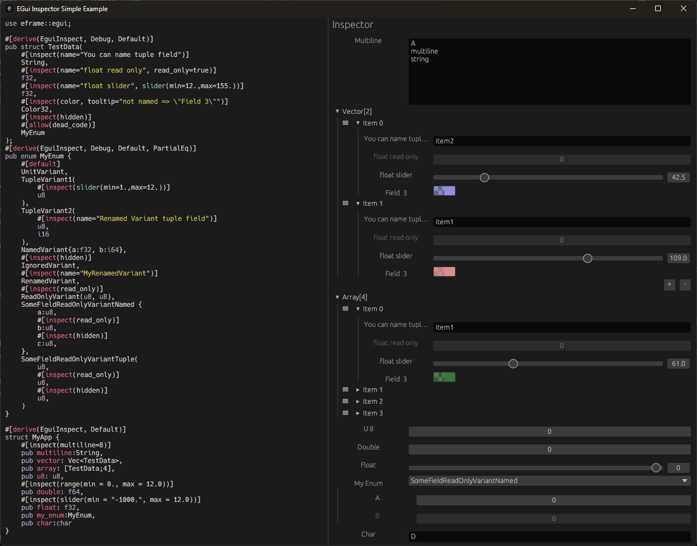

# egui_inspect


This crate is intended to provide some rust helper macros to automatically generate boilerplate code to inspect structures or enums.

Its goals are:
- to provide as much compile-time generated code as possible, avoiding conditional branches at runtime
- to be hyper user-friendly

This crate provide a `EguiInspect` trait which is necessary for a struct or enum to be inspected. This trait is implemented for many base
types, and can be implemented for user created types with the macro `#[derive(EguiInspect)]`.
If every underlying types implements `EguiInspect`, then you will be able to inspect it. If not, you can still be able to edit your type  by using ```hidden```, ```custom_fn``` or ```from_string``` attributes.

You optionally can add the `nalgebra_glm` feature which provide implementation of `EguiInspect` for `nalgebra_glm` types and the `datapicker` feature which provide implementation of `EguiInspect` for `NaiveDate`.

This is a side project, so the API might not be stable yet.

# Example
<a href="resources/screen_anim.gif">
  
</a>

You can add a reference to this crate in your Cargo.toml:
```toml
[dependencies]
egui_inspect = { git = "https://github.com/ultrasuperpingu/egui_inspect.git", features=["all"] }
egui_inspect_derive = { git = "https://github.com/ultrasuperpingu/egui_inspect.git" }
```

And then, instantiate a EguiInspector giving it a mutable reference to the object to inspect.

See the following examples:
 * [simple](egui_inspect/examples/simple.rs): a simple example
 * [advanced](egui_inspect/examples/advanced.rs): features more advanced features.
 * [manual_implement](egui_inspect/examples/manual_implement.rs): see [Implement `EguiInspect` yourself](#implement-eguiinspect-yourself)
 * [shared_data](egui_inspect/examples/shared_data.rs): features use of [Rc<RefCell<String>>], [Arc<Mutex<String>>] and [Arc<RwLock<String>>].
 * [nalgebra_glm](egui_inspect/examples/nalgebra_glm.rs): example with `nalgebra_glm` types.
 * [datepicker](egui_inspect/examples/datepicker.rs): example with `NaiveDate`.

# Documentation
## Available Attributes
This derive allows customizing how fields are displayed in a user interface (UI), typically using egui. The following attributes can be applied to struct fields or enum variants to control their behavior and appearance.

## Struct Attributes
Usage syntax:
```#[inspect(execute_btn(fn_name="my_method", tooltip="My Method"), execute_btn(fn_name="my_function", is_method=false, tooltip="My Function"))]```

## Fields Attributes
Usage syntax:
```#[inspect(name = "Label", tooltip = "Info", read_only, hidden)]```

List of attributes:
- ```name``` (```String```):
  Custom label to display in the UI instead of the field name.
  Available on all field.
- ```hidden``` (optional ```bool```) | optional = ```bool```:
  If true, the field will not be shown in the UI.
  Available on all field.
- ```read_only``` (optional ```bool```) | optional = ```bool```:
  Makes the field non-editable in the UI.
  Available on all field.
- ```multiline``` (optional ```u8```) | optional = ```u8```:
  If set, display the text on multiple lines. If affected to u8, it defines the number of rows to display.
  Available on fields implementing ```egui::TextBuffer```
- ```slider``` (min = ```String```|```f32```, max = ```String```|```f32```):
  Uses a slider widget for numeric fields with specified min/max values.
  Available on fields implementing ```egui::emath::Numeric```
- ```range``` (min = ```String```|```f32```, max = ```String```|```f32```):
  Defines min/max bounds for sliders or numeric inputs.
- ```color``` (optional ```bool```) | optional = ```bool```:
  Treats compatible fields as a color and shows a color picker.
- ```tooltip``` (```String```) | optional = ```String```:
  Tooltip text shown when hovering over the field in the UI.
- ```from_string```: (``bool``)
  Force edition from string conversion (needs type to implement [`FromStr`] and [`Display`])
- ```custom_fn```: (``String``)
  Use a custom function instead of calling [`EguiInspect::inspect_with_custom_id`]
- ```date``` (```DatePickerParams```)
  The date picker parameters:
    - ```combo_boxes```: (optional ```bool```)
    Show combo boxes in date picker popup. (Default: true)
    - ```arrows```: (optional ```bool```)
    Show arrows in date picker popup. (Default: true)
    - ```calendar```: (optional ```bool```)
    Show calendar in date picker popup. (Default: true)
    - ```calendar_week```: (optional ```bool```)
    Show calendar week in date picker popup. (Default: true)
    - ```show_icon```: (optional ```bool```)
    Show the calendar icon on the button. (Default: true)
    - ```format```: ```String```
    Change the format shown on the button. (Default: %Y-%m-%d)
    See [`chrono::format::strftime`] for valid formats.
    - ```highlight_weekends```: (optional ```bool```)
    Highlight weekend days. (Default: true)
    - ```start_end_years```: (min = ```String```|```i32```, max = ```String```|```i32```):

    Set the start and end years for the date picker. (Default: today's year - 100 to today's year + 10)

    This will limit the years you can choose from in the dropdown to the specified range.

    For example, if you want to provide the range of years from 2000 to 2035, you can use: `start_end_years(min=2000, max=2035)`.
	

## Implement `EguiInspect` yourself
The crate provides many functions to edit basic types. So implementing in simple cases is pretty straightforward.

For example:
```rust
struct MyStruct {
	a_bool:bool,
	an_int:i32,
	an_uint:u64,
	a_float:f32,
	a_color:egui::Color32,
	a_string:String,
	a_second_string:String,
}
impl egui_inspect::EguiInspect for MyStruct {
	fn inspect_with_custom_id(&mut self, _parent_id: egui::Id, label: &str, _tooltip: &str, read_only: bool, ui: &mut egui::Ui) {
		let id = if _parent_id == egui::Id::NULL { ui.next_auto_id() } else { _parent_id.with(label) };
		let _parent_id_to_provide_to_children = if _parent_id == egui::Id::NULL { egui::Id::NULL } else { id };
		let mut add_content=|ui:&mut egui::Ui| {
			egui_inspect::add_bool(&mut self.a_bool, "Bool", "Boolean Tooltip", read_only, ui);
			egui_inspect::add_number(&mut self.an_int, "Integer", "Integer Tooltip", read_only, None, ui);
			egui_inspect::add_number(&mut self.an_uint, "Unsigned Integer", "Unsigned Integer Tooltip with min/max", read_only, Some((12, 50000)), ui);
			egui_inspect::add_number_slider(&mut self.a_float, "Float", "Float Slider Tooltip", read_only, -12., 50., ui);
			egui_inspect::add_color(&mut self.a_color, "Color", "", read_only, ui);
			egui_inspect::add_string_singleline(&mut self.a_string, "String", "", read_only, ui);
			egui_inspect::add_string_multiline(&mut self.a_second_string, "Multiline String", "", read_only, 4, ui);
		};
		if !label.is_empty() {
			egui::CollapsingHeader::new(label).id_salt(id).show(ui, add_content);
		} else {
			add_content(ui);
		}
	}
}
```
See the [manual_implement](egui_inspect/examples/manual_implement.rs) example

## Why 2 inspect methods ?
The trait `EguiInspect` provide two methods :
 * `fn inspect(&mut self, label: &str, tooltip: &str, read_only: bool, ui: &mut egui::Ui);`
 * `fn inspect_with_custom_id(&mut self, parent_id: egui::Id, label: &str, tooltip: &str, read_only: bool, ui: &mut egui::Ui);`

The first method is a convenience wrapper: it’s implemented by default and simply calls the second one using parent_id = Id::NULL.

### Why Have Both?
Egui internally tracks widget state—such as whether a collapsible section is open, the scroll position, and other UI dynamics. To do this reliably, widgets that maintain state need a unique `Id`.
By default, egui generates these IDs automatically. However, this can lead to inconsistencies when the UI structure changes dynamically, especially if the auto-generated IDs don’t remain stable across frames.
That’s where `inspect_with_custom_id` comes in. It allows you to explicitly pass a `parent_id`, which helps maintain consistent and conflict-free IDs.

### How It Works
When `inspect_with_custom_id` is called, the implementation combines the parent_id with the widget’s label to generate a unique ID. This composite `Id` is then used for the widget itself and passed down to its children. This hierarchical `Id` scheme helps avoid `Id` collisions (at least, I hope) and should ensures stable widget behavior even when the UI changes. When `parent_id = Id::NULL`, egui auto generated `Id`s are used.


